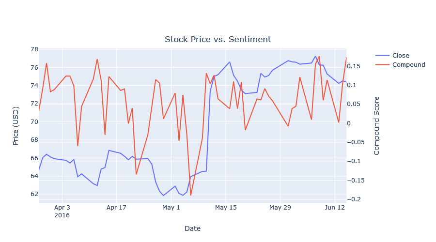

# Stock Prediction using Twitter Sentiment
This project leverages the sentiment about Electronic Arts (EA) to predict the future close price of its stocks. Historical stock data and sentiment analysis of Twitter posts was applied in conjunction with machine learning to make the predictions.

Stock prediction is a complex topic. Prices are very dynamic and are influenced by many factors, such as economic and political events, and company actions. 

Research in behavioural economics has shown that people are greatly affected by the emotions and opinions of others. Twitter is one of many social media platforms that offers a rich source of real-time information, social trends, and opinions. With over 300 million users globally, there is no doubt that influential users can influence the purchasing behaviour of traders.

## Key Findings
Analysis was performed on Twitter and stock data covering a period of 3 months from Mar - June 2016.

The compound score is a measurement of how negative, neutral, and positive a statement is, ranging between -1 (extreme negative) and +1 (extreme positive). The stock price and level of sentiment have a weak positive relationship. On certain days, a rise in positive sentiments follows an increase in the closing price of EA stocks and vice versa. The most prominent occurance was on May 10th, where there was an increase in both the compound score and stock price.

Predictions were made using XGBoost regression, which yielded RMSE of 1.06 and R-squared of -13%. The model relied heavily previous prices. In particular, yesterday's price turned out to be the most important feature. The sentiment from Twitter had less impact on the closing price of the stock.

## Limitations
The Twitter API has a limit on how far back posts can be retrieved, which would reduce the trading days for analysis. Twitter data obtained from [data.world](https://data.world/kike/nasdaq-100-tweets) was instead used for this project. The data also contained missing information for the Retweets and Followers attributes that could be used to determine a user's influence power, and thus, these attributes were not used for price prediction.

Future improvements:
1. News headlines are more reliable and may capture the trends much better
2. It is possible that multiple stock markets move together
3. Reframe into a classification problem to indicate the stock movement

## References
- https://www.researchgate.net/publication/315562673_Twitter_Data_Predicting_Stock_Price_Using_Data_Mining_Techniques
- https://www.analyticsvidhya.com/blog/2021/12/different-methods-for-calculating-sentiment-score-of-text/
- https://towardsdatascience.com/sentimental-analysis-using-vader-a3415fef7664
- https://huggingface.co/bert-base-multilingual-cased
- https://python.plainenglish.io/twitter-sentiment-analysis-using-vader-tweepy-b2a62fba151e